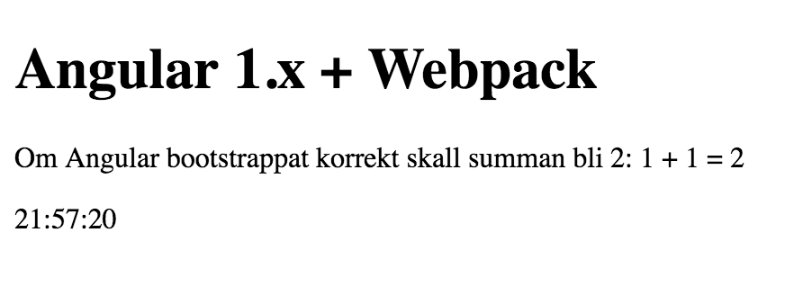

Bygga Angular 1.x med Typescript och Webpack
==========================================
OK, nu fortsätter vi där [web-with-webpack](../web-with-webpack) slutade. Nu ska vi bygga en
Angular 1.x-applikation med Typescript och Webpack.

Jag har valt att skippa Angular 2 för det finns redan så mycket tutorials och
starters för typescript och webpack (se t.ex
[Webpack: An introduction](https://angular.io/docs/ts/latest/guide/webpack.html) eller
[angular2-webpack-starter](https://github.com/AngularClass/angular2-webpack-starter)).

(Om du vill klippa och klistra finns fungerande kod under [./complete](./complete))

Vad behöver vi tänka på?
------------------------

- Se till att alla filer importeras, direkt eller indirekt. (Det finns an fuskväg som kan vara
bra när man har en massa existerande kod:
[webpack-angular-resource-plugin](https://github.com/liyutech/webpack-angular-resource-plugin),
men vi ska inte ta till såna knep.)
- Bootstrappa från kod för att ha kontroll på när bootstrapping körs.
- Implementera tjänster/controllers/moduler, etc., med typescript-klasser. 
- Bra (men inte obligatorisk) grej: använd Angular 1.5 [component](https://docs.angularjs.org/guide/component) för komponenter, ist.f direktiv.
- Bra grej 2: använd Angular 1.5's komponent-router 

Sätta upp projekt
-----------------
Vi börjar med samma projekt-setup som vi använde i [web-with-webpack](../web-with-webpack).

Skapa en ny katalog `ng1-webpack` och kopiera in följande filer från [web-with-webpack](../web-with-webpack): 

- `package.json` (byt "name"-värdet till "ng1-webpack") 
- `tsconfig.json`
- `config/`-katalogen med innehåll

Kör

```bash
$ npm install
```
	
Angular 1.5
-----------
OK, då ska vi lägga till Angular 1.5 samt se till att den bootstrappas.

Installera angular smat dess @types:

```bash
$ npm i -S angular
$ npm i -D @types/angular
$ npm i -D jquery # Angular behöver jQuery
```	

Vi ska se till att alla 3PP:er hamnar i en egen bundle genom att konfigurera webpack med poster för applikationen resp. 3PP:er 

i `config/webpack.common.js`:

```javascript
:
entry: {
  "main": "./src/Main.ts"	,
  "vendor": "./src/vendor.ts"
}
:
```

Och så lägger vi till filerna.

#### src/app.ts

```typescript
import * as ng1 from "angular";

ng1.bootstrap(document, [], {
   strictDi: false // Vi kräver att man använder explicit dependency injection
});
```	

#### src/vendor.ts

```typescript
import "angular";	
```

Tills sist lägger vi till `src/index.html`:

```html
<!DOCTYPE html>
<html lang="sv">
  <head>
    <meta charset="UTF-8">
    <title>CAG-labs</title>
  </head>
  <body>
    <h1>Angular 1.x + Webpack</h1>
    <p>Om Angular bootstrappat korrekt skall summan bli rätt: 1 + 1 = {{1+1}}</p>
  </body>
</html>
```

Kör sen 

```bash
$ npm start
```

Och öppna [http://localhost:8080/](http://localhost:8080/). 
Om allt funkar som det ska du se 

---

Lägga till en applikationsmodul
-------------------------------
Nu behöver vi en applikationsmodul. 

Vi lägger till `app.module.ts`:

```typescript
import * as ng1 from 'angular';

export const appModule = ng1.module('app.module', []);

console.debug('appModule is initialized');
```

Vi implementerar den sedan i våran `Main.ts`, samt lägger till som ett 
 beroende i våran bootstrap:
 
```typescript
:
import {appModule} from "./app.module";
:
ng1.bootstrap(document, [appModule.name], {
:
```

Om vi öppnar webläsarens konsol-fönster ska vi se en loggning:
 
    appModule is initialized
    
Lägga till en komponent
-----------------------
Nu skapar vi oss en komponent á la Angular 1.5 (mer att läsa finns på [Components](https://docs.angularjs.org/guide/component)). Vi gör en simpel
komponent som bara lägger till en klocka som uppdateras kontinuerligt.

Lägg till filen `src/clock/clock.component.ts`

```typescript
import * as ng1 from "angular";
import * as app from "../app.module"; 

class Controller implements ng1.IComponentController {
  time: string;

  constructor(private $timeout:ng1.ITimeoutService) {
    this.tick();
  }

  tick() {
    this.time = new Date().toLocaleTimeString('sv');
    this.$timeout(() => this.tick(), 1000);
  }
}

app.appModule.component('cagClock', {
  template: `
    <div>
    <p>{{$ctrl.time}}</p>
    </div>
      `,
  controller: ['$timeout', Controller]
});
```
Värt att notera ovan: 

- eftersom vi har bootstrappat med `strictDi`
  måste vi använda _inline array annotation_ i controller-tilldelningen, 
  för att explicit ange DI-parameternamn. 
  Detta för DI skall funka efter minifiering/uglifiering.
  Se _Inline Array Annotation_ i [Dependency Injection](https://docs.angularjs.org/guide/di) för detaljer.
- Controller-klassen agerar factory-metod (kommer ni ihåg konstruktorfunktioner i TS?).
  Instanser av klassen kommer vara åtkomliga som `$ctrl`i HTML. 
  Fälten i klassen blir således properties åtkomliga i HTML, som .t.ex
  `$ctrl.time`.

Och så måste vi importera den i `app.module.ts` så att den inkluderas
i applikationsbundeln och exekveras. Tänk på att den måste läggas sist
i filen så att `export const appModule = ...` definierats innan import.

```typescript
:
export const appModule = ng1.module('app.module', []);

import "./clock/clock.component";
:
```

Till sist använder vi komponenten i `index.html`:

```html
:
  <body>
    <h1>Angular 1.x + Webpack</h1>
    <p>Om Angular bootstrappat korrekt skall summan bli 2: 1 + 1 = {{1+1}}</p>
    <cag-clock></cag-clock>
  </body>
:
```

Nu skall sidan visa tiden:


---

